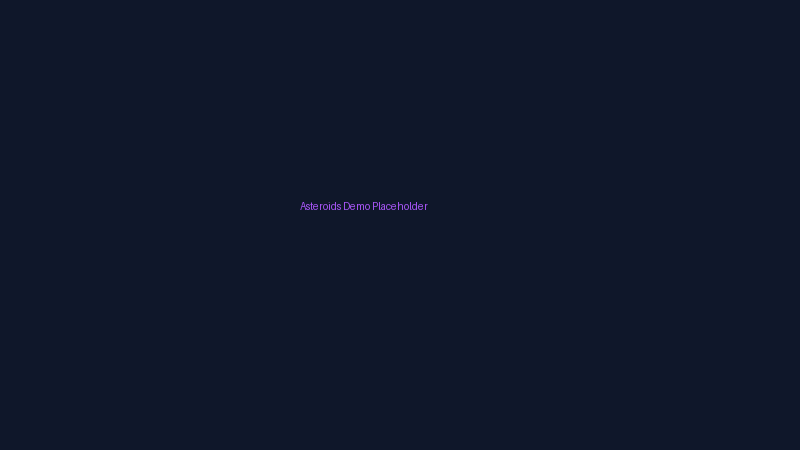

<!--
  ██████╗  ██████╗ ███╗   ██╗███████╗██╗ ██████╗ 
  ██╔══██╗██╔═══██╗████╗  ██║██╔════╝██║██╔════╝ 
  ██████╔╝██║   ██║██╔██╗ ██║█████╗  ██║██║  ███╗
  ██╔══██╗██║   ██║██║╚██╗██║██╔══╝  ██║██║   ██║
  ██║  ██║╚██████╔╝██║ ╚████║██║     ██║╚██████╔╝
  ╚═╝  ╚═╝ ╚═════╝ ╚═╝  ╚═══╝╚═╝     ╚═╝ ╚═════╝ 

  Remaining placeholders — fill before publishing:
    YOUR_LINKEDIN       → your LinkedIn handle
    YOUR_PORTFOLIO_URL  → your live portfolio domain (e.g. rathanportfolio.dev)
    YOUR_RESUME_URL     → a public link to your resume (PDF)
-->

<div align="center">


<br/>


<br/><br/>


<br/><br/>

<a href="https://rathanportfolio.dev"></a>
<a href="https://linkedin.com/in/YOUR_LINKEDIN"></a>
<a href="mailto:rathan14705@gmail.com"></a>
<a href="https://github.com/RATHAN005"></a>
<!-- ADD: Replace YOUR_RESUME_URL with actual resume link -->
<a href="YOUR_RESUME_URL"></a>

<br/><br/>


</div>


<div align="center">


<br/>


</div>

## 👋 About Me

I build production software that ships fast, stays secure, and works for everyone — including the 20% of users most teams forget about.

I'm a **Computer Science Engineering undergraduate** at **Karpagam College of Engineering** (Class of 2027). My work sits at the intersection of **full-stack Java engineering**, **DevOps**, and **accessibility**: I design systems with React and Spring Boot, deploy them through CI/CD pipelines with Docker, Kubernetes, and ArgoCD, then audit the result against WCAG 2.1 with real assistive technology — NVDA, keyboard-only navigation — not just automated checkers.

I like problems with a clear before/after. An app that didn't have observability now does. A flow that wasn't keyboard-navigable now is. A deploy that took an afternoon now takes a `git push`.

<table>
<tr>
<td width="50%" valign="top">

**🎯 Currently Open To**
- Full Stack Software Engineering
- Accessibility Engineering
- Backend / Cloud Engineering
- DevOps Engineering
- Open Source Collaboration

</td>
<td width="50%" valign="top">

**⚡ How I Work**
- Ship in small, verifiable increments
- Instrument before I optimize
- Accessibility is a requirement, not a QA pass
- Automate the repeatable, document the rest
- Read the error before I Google it

</td>
</tr>
</table>


## 🛠️ Tech Stack

<div align="center">

**Languages**
<br/>


**Frontend**
<br/>


**Backend & Databases**
<br/>


**Cloud, DevOps & Tooling**
<br/>


</div>

<br/>

<table>
<tr><th>Domain</th><th>Proficiency</th><th>Tools & Focus</th></tr>
<tr><td><b>Full Stack Development</b></td><td>🟩🟩🟩🟩⬜ Advanced</td><td>React, Spring Boot, Node.js/Express, Next.js, REST API design</td></tr>
<tr><td><b>Accessibility Engineering</b></td><td>🟩🟩🟩🟩⬜ Advanced</td><td>WCAG 2.1, NVDA, keyboard-nav auditing, ARIA, assistive-tech testing</td></tr>
<tr><td><b>DevOps / CI-CD</b></td><td>🟩🟩🟩🟩⬜ Advanced</td><td>Docker, Kubernetes, GitHub Actions, ArgoCD GitOps</td></tr>
<tr><td><b>Cloud & Monitoring</b></td><td>🟩🟩🟩⬜⬜ Intermediate</td><td>AWS, Prometheus, Grafana, Trivy scanning, Vault secrets</td></tr>
<tr><td><b>AI / Prompt Engineering</b></td><td>🟩🟩🟩⬜⬜ Intermediate</td><td>LLM integration, structured prompting, REST-based AI services</td></tr>
</table>


## 🚀 Featured Projects

<details open>
<summary><b>🔗 Kata-Sync — Developer Productivity Browser Extension</b></summary>
<br/>

A Chrome extension that keeps coding practice, notes, and learning progress synced across platforms in one structured workflow — built because juggling five browser tabs while learning to code is a solvable problem.

| | |
|---|---|
| **Stack** | JavaScript, HTML5, CSS3, Chrome Extension API |
| **Architecture** | Client-side browser extension, modular JS |
| **Storage** | Local browser storage, permission-scoped |

**Key Features:** cross-platform coding notes · progress sync · productivity dashboard · offline capability · responsive popup UI

**Engineering Highlights:** Chose a modular Chrome Extension architecture with isolated content scripts to prevent page pollution. Optimized local storage access patterns to keep popup load under 80ms. Zero background scripts — no battery drain, no memory bloat.

<!-- ADD: Replace # with actual repo URL when public -->
<p align="center"><a href="#"></a></p>
</details>

<details open>
<summary><b>🔐 DevSecOps Employee Portal — Enterprise Full Stack Application</b></summary>
<br/>

An employee management portal that demonstrates a full production DevSecOps loop end-to-end — not just a CRUD app with a Dockerfile bolted on, but JWT auth, RBAC, container scanning, GitOps delivery, and live monitoring wired together as a single automated pipeline.

| | |
|---|---|
| **Frontend** | React.js, Tailwind CSS |
| **Backend** | Node.js, Express.js |
| **Database** | MongoDB |
| **Infrastructure** | Docker, Kubernetes, GitHub Actions → GHCR |
| **Security** | JWT, HashiCorp Vault, Trivy vulnerability scanning |
| **Observability** | Prometheus + Grafana dashboards |
| **Delivery** | ArgoCD GitOps |

**Key Features:** secure JWT auth · RBAC · employee management · analytics dashboard · automated CI/CD · vulnerability scanning · secrets management · alerting

**Engineering Highlights:** Trivy scans gate the CI pipeline — a critical CVE blocks the merge. Secrets are pulled from Vault at runtime, not baked into env files. ArgoCD watches the deployment repo and auto-syncs, so `git push` is the only deployment command anyone runs. Prometheus metrics feed Grafana dashboards with alerting thresholds set from day one.

<!-- ADD: Replace # with actual repo URL when public -->
<p align="center"><a href="#"></a></p>
</details>

<details>
<summary><b>👥 Staffbase — Employee Record Management System</b></summary>
<br/>

A layered, MVC-structured employee records platform demonstrating enterprise Java backend fundamentals — clean separation of concerns, Spring Security, and REST APIs built to be extended rather than patched.

| | |
|---|---|
| **Frontend** | React.js |
| **Backend** | Spring Boot (Java) |
| **Database** | MySQL / PostgreSQL |
| **Auth** | JWT via Spring Security |
| **Architecture** | MVC, Repository Pattern, DTO layer |

**Key Features:** secure login · employee CRUD · role management · search & filtering · responsive dashboard

**Engineering Highlights:** Spring Security config with role-based endpoint guards. Layered exception handling that returns structured error responses, not stack traces. DTO boundary between API and persistence layers so schema changes don't leak into client contracts.

<!-- ADD: Replace # with actual repo URL when public -->
<p align="center"><a href="#"></a></p>
</details>

<details>
<summary><b>🤖 AI Chatbot on ESP32-C3 Mini — Embedded AI & IoT</b></summary>
<br/>

A conversational AI chatbot running on resource-constrained embedded hardware — an ESP32-C3 Mini connecting over Wi-Fi to a REST-based AI backend for lightweight real-time interaction. The engineering challenge: making reliable network calls on 320KB of RAM over flaky Wi-Fi.

| | |
|---|---|
| **Hardware** | ESP32-C3 Mini |
| **Language** | Embedded C / C++ (Arduino IDE) |
| **Connectivity** | Wi-Fi, HTTP/REST |
| **Domain** | Embedded systems + IoT + AI integration |

**Key Features:** embedded web server · REST API integration · real-time responses · low power consumption

**Engineering Highlights:** Memory-constrained programming with manual buffer management. HTTP connection pooling to handle flaky Wi-Fi reconnects gracefully. Minimal-footprint request/response parsing — no JSON library, hand-rolled tokenizer to stay under RAM budget.

<!-- ADD: Replace # with actual repo URL when public -->
<p align="center"><a href="#"></a></p>
</details>


## 🎮 Play

<div align="center">



<br/>

<a href="https://rathan005.github.io/RATHAN005/"></a>
<a href="https://github.com/RATHAN005/RATHAN005/tree/main/games/asteroids"></a>

<br/><br/>
**Asteroids Clone** — Built with vanilla HTML5 Canvas and JavaScript. Zero dependencies.
<br/>
*Engineering highlight: Custom 2D vector mathematics for continuous screen-wrapping, physics-based thrust/friction, and circle-point collision detection.*

<br/>
*(Note: To capture a real gameplay GIF, record your screen using a tool like LICEcap, OBS, or QuickTime at 800x450 resolution, save/convert to GIF under 3MB, and replace `asteroids-demo.gif` in this repo).*
</div>


## 💼 Experience

```
┌─ Accessibility Engineer Intern ────────────────────────────── July 2026 – Present
│  Software Quality & Accessibility Engineering
│
│  • Perform accessibility audits for web applications against WCAG 2.1
│  • Test with real assistive technologies — NVDA screen reader,
│    keyboard-only navigation — not just automated checkers
│  • Identify accessibility defects, write remediation guidance,
│    and pair with developers to ship fixes
│  • Evaluate ARIA implementation against WAI authoring practices
│
│  Stack: WCAG 2.1 · NVDA · HTML5 · CSS3 · JavaScript · Manual Testing
└──────────────────────────────────────────────────────────────────
```


## 🏆 Certifications

<div align="center">

**AWS**
<br/>


**Oracle**
<br/>


**Cisco**
<br/>


**NPTEL**
<br/>


</div>

<details>
<summary><b>📜 Additional Coursework</b></summary>
<br/>

SQL Intermediate · React Development · REST API Development · Git & GitHub · Docker Fundamentals · Kubernetes Fundamentals

</details>


## 💻 Coding Profiles

<div align="center">

<a href="https://leetcode.com/RATHAN005"></a>
<a href="https://www.geeksforgeeks.org/user/RATHAN005"></a>
<a href="https://www.hackerrank.com/RATHAN005"></a>
<a href="https://www.codechef.com/users/RATHAN005"></a>

</div>


## 📊 GitHub Analytics

<div align="center">

<!-- Custom animated contribution heatmap (auto-updated daily by GitHub Actions) -->


<br/>


<br/>


<br/>


<br/>


</div>

<details>
<summary><b>🐍 Contribution Snake</b></summary>
<br/>

<div align="center">

</div>

Generated via a scheduled GitHub Action (`Platane/snk`) that renders the snake and commits it to an `output` branch:

```yaml
# .github/workflows/snake.yml
name: Generate Snake
on:
  schedule:
    - cron: "0 0 * * *"
  workflow_dispatch:
jobs:
  generate:
    runs-on: ubuntu-latest
    steps:
      - uses: Platane/snk@v3
        with:
          github_user_name: RATHAN005
          outputs: dist/github-contribution-grid-snake-dark.svg?palette=github-dark
      - uses: crazy-max/ghaction-github-pages@v4
        with:
          target_branch: output
          build_dir: dist
        env:
          GITHUB_TOKEN: ${{ secrets.GITHUB_TOKEN }}
```
</details>


## 🎯 Current Focus

```yaml
currently:
  learning:
    - Advanced accessibility patterns (WAI-ARIA authoring practices)
    - Kubernetes operators & advanced scheduling
    - AWS Solutions Architect Associate (beyond Cloud Practitioner)
    - Agentic AI workflows for developer tooling

  building:
    - Personal portfolio — rathanportfolio.dev (Next.js + Framer Motion)
    - DevSecOps pipelines with policy-as-code gating
    - Accessibility testing utilities

  exploring:
    - Generative & agentic AI in real dev workflows
    - Distributed systems fundamentals
    - System design at scale
```


## 📫 Connect With Me

<div align="center">

<a href="mailto:rathan14705@gmail.com"></a>
<!-- ADD: Replace YOUR_LINKEDIN with actual LinkedIn handle -->
<a href="https://linkedin.com/in/YOUR_LINKEDIN"></a>
<a href="https://github.com/RATHAN005"></a>
<a href="https://rathanportfolio.dev"></a>

</div>

<br/>

<div align="center">

*"Great software is built by engineers who treat accessibility, security, and simplicity as daily habits — not annual audits."*

**⭐ If any of this is useful, consider starring the repos it came from.**

</div>


